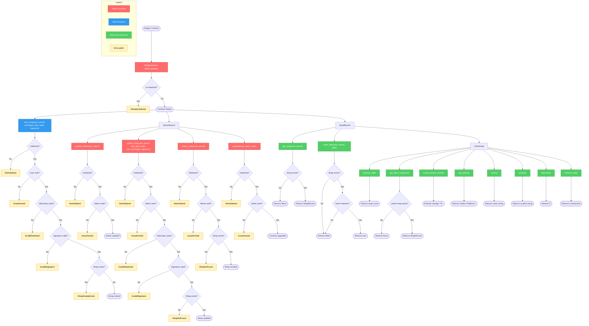
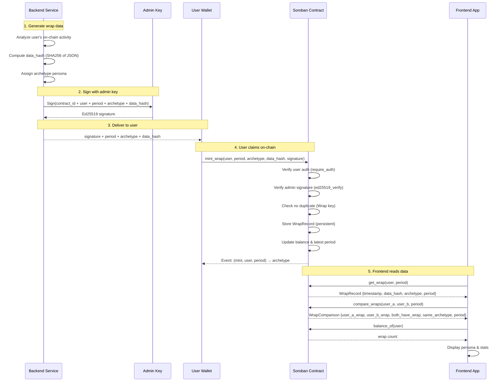

# Stellar Wrap - Smart Contract

> **The on-chain Soulbound Token (SBT) registry for Stellar Wrap. This contract stores non-transferable wrap records linked to user addresses, containing data hashes and persona archetypes.**

This repository contains the **Soroban smart contract** that serves as the on-chain anchor for Stellar Wrap. For the full application (frontend, backend, etc.), see the main Stellar Wrap repository.

---

## 📖 What is Stellar Wrap?

Stellar Wrap is a "Spotify Wrapped"-style experience built specifically for the Stellar community.

Block explorers are great for data, but terrible for stories. Stellar Wrap takes your raw, complex on-chain history—transactions, smart contract deployments, NFT buys—and transforms it into a beautiful, personalized visual story that anyone can understand and share.

By simply connecting your wallet, you get a dynamic snapshot of your month on Stellar, highlighting your achievements and assigning you a unique on-chain persona based on your activity.

**It's more than just stats; it's a tool for builders to prove their contributions and for users to flex their participation in the Stellar ecosystem.**

--- 

## 💡 Why We Need This

In Web3, your on-chain history is your resume, your identity, and your reputation. But right now, that reputation is hidden behind confusing transaction hashes.

**Stellar Wrap solves the visibility gap:**

- **For Builders & Developers:** It's hard to showcase the immense value of deploying open-source Soroban contracts. Stellar Wrap makes their code contributions visible and shareable to non-technical users.
- **For the Community:** We lack easy, viral loops to share excitement about what's happening on Stellar. This tool gives everyone a reason to post about their on-chain life on social media.
- **For Users:** It turns isolated transactions into a sense of progress and belonging within the ecosystem.

---

## 🚀 How the Contract Works

This smart contract provides the on-chain registry for Stellar Wrap records:

1.  **Initialize:** The contract is initialized once with an admin address that has permission to mint wrap records.
2.  **Mint Wrap:** The admin (backend service) calls `mint_wrap()` to create a soulbound record for a user, storing:

- Timestamp of when the wrap was generated
- SHA256 hash of the full off-chain JSON data (ensuring integrity)
- Archetype/persona assigned to the user (e.g., _"soroban_architect"_, _"defi_patron"_, _"diamond_hand"_)

3.  **Query:** Anyone can call `get_wrap()` to retrieve a user's wrap record, enabling verification and display of on-chain personas.
4.  **Compare:** Anyone can call `compare_wraps()` to compare two users' visible wraps for the same period in one read.
5.  **Soulbound:** Records are non-transferable (SBT), permanently linked to the user's Stellar address.

### Contract Interaction Flowchart

The diagram below shows the complete contract lifecycle — from deployment through initialization, minting, querying, verification, and optional admin operations. Decision diamonds highlight authorization and validation checks; yellow nodes are error paths.



---

## 🎯 Key Metrics Tracked

We look beyond simple payments to capture the full spectrum of Stellar's vibrant ecosystem:

- **🧙‍♂️ Soroban Builder Stats:** Contracts deployed and unique user interactions. (Critical for developer reputation!).
- **🤝 dApp Interactions:** Which ecosystem projects did you support the most?
- **🎨 NFT Activity:** New mints collected and top creators supported.
- **💸 Network Volume:** A summary of your general transaction activity.
- **🏆 Your Monthly Persona:** A gamified badge that reflects your unique contribution style.

---

## Ecosystem Impact

This project is designed to support the growth of the Stellar network by:

1.  **Incentivizing Building:** Publicly celebrating developers who ship code creates positive reinforcement. A "Soroban Architect" badge is a social flex that encourages more building.
2.  **Driving Viral Activity:** Every shared Stellar Wrap card is organic marketing for the blockchain, showing the world that Stellar is active and being used.
3.  **Increasing Retention:** Giving users a personalized summary fosters a sense of ownership and encourages them to come back next month to beat their stats.

---

## 🏗️ Architecture

The diagram below shows how on-chain and off-chain components interact in the Stellar Wrap system:



---

## 📦 WASM Size Tracking

The CI pipeline enforces a WASM binary size limit to catch regressions before they reach production.

### How it works

Every push and pull request runs the `wasm-size` CI job, which:

1. Builds the contract in release mode (`--target wasm32-unknown-unknown`)
2. Reads the limit from `.github/wasm-size-limit` (in bytes)
3. Fails the build if the compiled WASM exceeds the limit
4. Reports current size, limit, and remaining headroom in the job summary
5. On pull requests, reports the size delta compared to the base branch
6. Uploads the WASM binary as a GitHub Actions artifact (90-day retention) for historical trending

### Updating the size limit

If you intentionally add features that increase the WASM size, update the limit file:

```bash
# Check current compiled size
cargo build --release --target wasm32-unknown-unknown
wc -c target/wasm32-unknown-unknown/release/stellar_wrap_contract.wasm

# Update the limit to new size + 20% buffer (example: 85000 bytes → 102000)
echo "102000" > .github/wasm-size-limit
```

Commit the updated `.github/wasm-size-limit` alongside your feature PR so reviewers can see the intentional size increase.

> **Hard limits:** Soroban enforces a maximum contract size of **256 KB** (262144 bytes). Keep the repo limit well below this to leave headroom for future features.

---

## 🔢 Named Constants

All magic numbers in the contract are defined in `src/constants.rs`:

| Constant | Value | Meaning |
|---|---|---|
| `LEDGERS_PER_DAY` | `17280` | Ledgers produced per day (~5 s block time) |
| `TTL_DAYS` | `365` | Default TTL period in days |
| `DEFAULT_TTL_LEDGERS` | `17280 × 365 = 6,307,200` | ~1-year TTL used for all persistent storage |
| `HASH_AND_KEY_LEN` | `32` | SHA-256 hash / Ed25519 public key length (bytes) |
| `SIGNATURE_LEN` | `64` | Ed25519 signature length (bytes) |
| `DEFAULT_COUNT` | `0` | Initial value for wrap count storage |
| `DEFAULT_LATEST_PERIOD` | `0` | Initial value for latest-period tracker |

---

## 🛠️ Tech Stack

- **Language:** Rust
- **Smart Contract Framework:** Soroban SDK v21.7.1
- **Build Tool:** Cargo
- **Target:** WebAssembly (WASM) for Soroban runtime
- **Testing:** Soroban SDK testutils

---

## 🗺️ Contract Features

- ✅ Admin-controlled initialization

---

## ✅ Added (v0.1.0)


### Public contract functions introduced in v0.1.0
-->

- `initialize(e, admin, admin_pubkey)`
- `update_admin(e, new_admin)`
- `mint_wrap(e, user, period, archetype, data_hash, signature)`
- `update_wrap(e, user, period, new_data_hash, new_archetype, signature)`
- `revoke_wrap(e, user, period)`
- `get_wrap(e, user, period)`
- `balance_of(e, id)`
- `verify_data(e, user, period, data)`
- `get_latest_wrap(e, user)`
- `extend_ttl(e, user, period)`
- `get_admin(e)`
- `name(e)`
- `symbol(e)`
- `decimals(e)`
- `contract_info(e)`
- `upgrade(e, new_wasm_hash)`

### Storage schema introduced in v0.1.0

#### `DataKey` variants
- `Admin`
- `AdminPubKey`
- `Wrap(Address, u64)`
- `WrapCount(Address)`
- `LatestPeriod(Address)`
- `MintGuard(Address)`

#### `WrapRecord` fields
- `timestamp: u64`
- `data_hash: BytesN<32>`
- `archetype: Symbol`
- `period: u64`

### Tooling / build details
- Soroban SDK: **21.7.1**
- Rust edition: **2021**

### Deployed testnet contract
- Testnet contract address: **TBD**

---

## ✅ Added (v0.1.0) (contract and storage schema)

### Public contract functions introduced in v0.1.0

- `initialize(e, admin, admin_pubkey)`
- `update_admin(e, new_admin)`
- `mint_wrap(e, user, period, archetype, data_hash, signature)`
- `update_wrap(e, user, period, new_data_hash, new_archetype, signature)`
- `revoke_wrap(e, user, period)`
- `get_wrap(e, user, period)`
- `balance_of(e, id)`
- `verify_data(e, user, period, data)`
- `get_latest_wrap(e, user)`
- `extend_ttl(e, user, period)`
- `get_admin(e)`
- `name(e)`
- `symbol(e)`
- `decimals(e)`
- `contract_info(e)`
- `upgrade(e, new_wasm_hash)`

### Storage schema introduced in v0.1.0

#### `DataKey` variants
- `Admin`
- `AdminPubKey`
- `Wrap(Address, u64)`
- `WrapCount(Address)`
- `LatestPeriod(Address)`
- `MintGuard(Address)`

#### `WrapRecord` fields
- `timestamp: u64`
- `data_hash: BytesN<32>`
- `archetype: Symbol`
- `period: u64`

### Tooling / build details
- Soroban SDK: **21.7.1**
- Rust edition: **2021**

### Deployed testnet contract
- Testnet contract address: **TBD**

- ✅ Soulbound token (SBT) minting with authorization checks
- ✅ Wrap record storage (timestamp, data hash, archetype)
- ✅ Public query interface for retrieving wrap records
- ✅ Public comparison interface for comparing two users' wraps
- ✅ Event emission for minting actions
- ✅ Prevention of duplicate wraps per user
- ✅ Contract upgrade mechanism (admin-only WASM upgrade via `upgrade()`)

## Privacy Note

`compare_wraps(user_a, user_b, period)` is intentionally read-only and public, like `get_wrap`. That means it can reveal whether each user has a visible wrap for that period, and whether both users share the same archetype. Frontends should present this clearly, and if wrap visibility opt-out is enabled, opted-out users should resolve as `None` in comparisons rather than exposing their record.

### Upgrading the Contract

The contract supports in-place WASM upgrades via Soroban's `update_current_contract_wasm`. All persistent storage (wrap records, admin key, etc.) is preserved across upgrades.

**Process:**
1. Upload the new WASM to the Stellar network and note its hash.
2. Call `upgrade(new_wasm_hash)` — requires admin authorization.
3. Soroban validates the hash against the uploaded blob and atomically replaces the code.

Only the admin address can trigger an upgrade. Any call without valid admin authorization will be rejected.

### Storage Schema Migration (v1 → v2)

Schema version is stored in instance storage (`DataKey::SchemaVersion`). `initialize()` sets version `1`. After deploying upgraded WASM that adds the `image_uri` field to `WrapRecord`, the admin must call:

```
migrate(from_version=1, to_version=2)
```

**Procedure:**
1. Upload and deploy new WASM via `upgrade(new_wasm_hash)`.
2. Call `migrate(1, 2)` once — requires admin auth. Emits a `(schema, migrat)` event.
3. Verify `get_schema_version()` returns `2`.
4. Existing v1 records are **lazily migrated** on first `get_wrap` read: upgraded in storage and a `(migrat, user, period)` event is emitted.

`migrate()` is guarded — it only succeeds when the stored version equals `from_version` and `to_version == from_version + 1`. A second call with the same transition panics with `InvalidMigration` (#11).

While schema version is `1`, new mints are stored in v1 format. After migration, new mints use v2 format (`image_uri` included).

### Merkle Batch Claims

For large airdrops, the admin publishes a single merkle root per period instead of signing each mint:

1. **Off-chain:** Build a binary merkle tree over claim leaves (see `scripts/merkle.ts`).
2. **On-chain:** Admin calls `set_merkle_root(period, root)`.
3. **Claim:** Each user calls `claim_wrap(user, period, archetype, data_hash, proof)` with `user.require_auth()`.

**Leaf encoding** (must match contract `compute_merkle_leaf`):

```
leaf = SHA-256( XDR(user) ‖ XDR(period) ‖ XDR(archetype) ‖ XDR(data_hash) )
```

**Internal nodes:** `SHA-256( min(left,right) ‖ max(left,right) )` (32-byte hashes, lexicographic order).

Double-claims are prevented via `MerkleClaimed(user, period)`. Claims produce the same `WrapRecord` and `(mint, user, period)` event as `mint_wrap`.

### User Privacy Opt-Out

Users may hide their wraps from public queries without deleting soulbound records:

- `opt_out(user)` — requires user auth; `get_wrap` / `get_latest_wrap` return `None`
- `opt_in(user)` — restores visibility
- `balance_of` and `verify_data` remain functional for composability
- Admin `revoke_wrap` still works on opted-out users

---

## 📊 Design Decision: On-Chain `WrapCount` and `balance_of`


**Issue [#40](https://github.com/zintarh/stellar-wrap-contract/issues/40) — Considered removing `WrapCount` storage**

### The trade-off

`WrapCount` is a persistent storage entry incremented on every `mint_wrap` call. This means every mint performs two persistent storage writes (the `WrapRecord` and the `WrapCount`). Since mints also emit events, the count *could* be derived off-chain by indexing those events.

### Decision: **Keep `WrapCount` and `balance_of`**

**Rationale:**

1. **On-chain composability.** `balance_of(user)` allows other Soroban contracts to read a user's wrap count in a single storage read. Removing it would make composability with future on-chain logic impossible without an expensive storage scan.
2. **Predictable cost.** One extra persistent write per mint is a fixed, bounded cost. Lazy counting via storage iteration would be unbounded and far more expensive at query time.
3. **Off-chain indexing is unreliable as a source of truth.** Events are not stored in contract state; an indexer can miss events or be unavailable. On-chain state is the canonical source of truth.

**Alternatives considered and rejected:**

| Option | Why rejected |
|---|---|
| Remove `WrapCount`, derive from events | Breaks on-chain composability; indexer dependency |
| Lazy count (iterate storage) | O(n) cost per query; prohibitively expensive at scale |
| Keep as-is | ✅ **Selected** — fixed cost, composable, canonical |

---

## 🔒 Mint Guard Storage Decision

The mint reentrancy guard uses Soroban temporary storage, not persistent storage.

- Temporary storage is cheaper and matches the guard lifecycle (single invocation scope).
- On successful mint, the guard key is removed explicitly.
- On failure paths (panic), the temporary entry is not persisted forever and is naturally cleaned up by Soroban TTL.


## 📝 Contract Interface

### Functions

- `DataKey::Admin`: Stores the admin address
- `DataKey::AdminPubKey`: Stores the Ed25519 public key used for signature verification
- `DataKey::Wrap(Address, u64)`: Maps user addresses and periods to their wrap records
- `DataKey::WrapCount(Address)`: Tracks the number of wraps minted for a user
- `DataKey::AllowedArchetypes`: Stores the admin-managed archetype allowlist

## Archetype Validation

Archetypes remain stored as `Symbol` values for backwards compatibility with existing wraps and the v1-to-v2 lazy migration path. Replacing the field with a contract enum would reduce storage variability, but it would be a breaking storage migration because records already serialized with `Symbol` would no longer decode cleanly.

The contract therefore uses an admin-managed allowlist. `initialize()` seeds the list with known short archetypes used by the project and current tests: `builder`, `arch`, `architect`, `soroban`, `defi`, and `patron`. Admins can update it with `add_archetype()` and `remove_archetype()`. `mint_wrap()`, `claim_wrap()`, and `update_wrap()` reject archetypes that are not present in the allowlist.

## Testnet Deployment

The `.github/workflows/deploy-testnet.yml` workflow deploys automatically on pushes to `main` and can also be run manually with `workflow_dispatch`.

Required GitHub Actions secrets:

- `STELLAR_DEPLOYER_SECRET`: secret key for the funded Stellar testnet deployer account.
- `STELLAR_ADMIN_PUBKEY`: Ed25519 public key used by `initialize()` to verify wrap signatures on fresh deployments.

Optional GitHub Actions secret:

- `STELLAR_TESTNET_CONTRACT_ID`: existing testnet contract ID. When present, the workflow installs the new WASM and calls `upgrade()` instead of deploying a fresh contract.

Manual dispatch inputs:

- `contract_id`: overrides `STELLAR_TESTNET_CONTRACT_ID` for an ad-hoc upgrade.
- `admin_address`: admin address used when initializing a new deployment. Defaults to the deployer public key.
- `admin_pubkey`: overrides `STELLAR_ADMIN_PUBKEY` for a fresh deployment.
- `initialize`: whether to call `initialize()` after a fresh deployment.

Every deployment writes `contract-id.txt` as a GitHub Actions artifact and adds the contract ID plus `get_admin()` smoke-test result to the job summary.

### Error Codes


